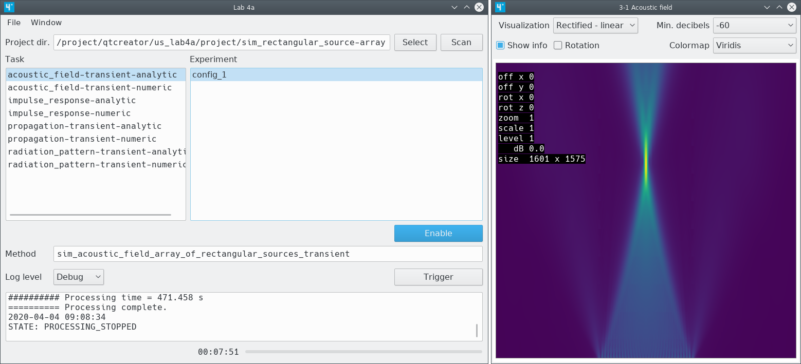

us_lab4a
========

us_lab4a is a tool for acoustic field simulation and ultrasound imaging.

Features (partial list)
-----------------------

- Acoustic field simulation of circular sources, rectangular sources and
  arrays of rectangular sources (analytic and numeric methods).
  - Acoustic field of transient waves.
  - Spatial impulse response.
  - Transient propagation.
  - Radiation pattern of transient waves.
- Simulated and experimental ultrasound imaging using 1D or 2D arrays.
  - Synthetic Transmit Aperture (STA) / Total Focusing Method (TFM).
  - SAFT (one transmitter and one receiver in each acquisition).
  - Single virtual source.

Status
------

- The software is experimental.
- The structure of the configuration files and the parameter names may change
  in future revisions.
- The documentation is very limited. In many cases the C++ code must be
  consulted.

License
-------

C++ source code:
> This program is free software: you can redistribute it and/or modify
> it under the terms of the GNU General Public License as published by
> the Free Software Foundation, either version 3 of the License, or
> (at your option) any later version.
> This program is distributed in the hope that it will be useful,
> but WITHOUT ANY WARRANTY; without even the implied warranty of
> MERCHANTABILITY or FITNESS FOR A PARTICULAR PURPOSE.  See the
> file GPL.txt for more details.

The scripts are in the public domain.

The .txt and .h5 files are in the public domain.

External code
-------------

The LZF filter for HDF5 has been provided by the [h5py][] project
(files in src/external/lzf).

[h5py]: https://www.h5py.org/
